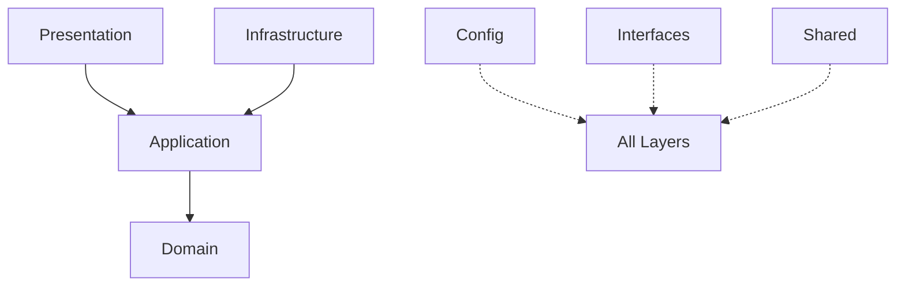

# 🔐 ByteBerry OAuth2 Service

[](https://github.com/JRuvalcabaFSD/ByteBerry-oauth2/actions/workflows/pr-ci.yml)
[](https://github.com/JRuvalcabaFSD/ByteBerry-oauth2/blob/main/package.json)
[](https://github.com/JRuvalcabaFSD/ByteBerry-oauth2/releases)
[](https://hub.docker.com/r/jruvalcabafsd/byteberry-oauth2)
[](./LICENSE)

Servidor OAuth2 con **Authorization Code + PKCE**, **JWT RS256**, **refresh tokens** y **JWKS** para el sistema de gestión de gastos ByteBerry.

## 📋 Tabla de Contenidos

- [🎯 Características](#-características)
- [🏗️ Arquitectura](#️-arquitectura)
- [🚀 Inicio Rápido](#-inicio-rápido)
- [📦 Instalación](#-instalación)
- [⚙️ Configuración](#️-configuración)
- [🔧 Desarrollo](#-desarrollo)
- [🧪 Testing](#-testing)
- [🐳 Docker](#-docker)
- [📊 API Endpoints](#-api-endpoints)
- [🔍 Health Checks](#-health-checks)
- [📚 Scripts Disponibles](#-scripts-disponibles)
- [🚀 CI/CD](#-cicd)
- [📖 Documentación](#-documentación)
- [🤝 Contribuir](#-contribuir)

---

## 🎯 Características

### ✨ OAuth2 Features (F1+)
- 🔐 **Authorization Code + PKCE** flow
- 🎫 **JWT RS256** tokens con rotación de claves
- 🔄 **Refresh tokens** seguros
- 📋 **JWKS** endpoint (`.well-known/jwks.json`)
- 🚪 **Logout** con invalidación de tokens

### 🏗️ Arquitectura Técnica
- 🧱 **Clean Architecture** (7 capas)
- 💉 **Dependency Injection Container** custom
- 🔒 **Principios SOLID** + **POO**
- 📦 **Repository + Adapter patterns**
- 🏥 **Health checks** básicos y profundos

### 🛠️ Stack Tecnológico
- ⚡ **Node.js 22.x** + **TypeScript 5.9.2**
- 🚀 **Express.js 5.1.0** + **Helmet** + **CORS**
- 📝 **Winston 3.18.3** (logging estructurado)
- 🧪 **Jest 30.1.3** (98.64% coverage)
- 🐳 **Docker** multi-arch (ARM64 + AMD64)
- 📦 **pnpm@10.18.3** package manager

---

## 🏗️ Arquitectura

### 📁 Clean Architecture (7 Capas)

```
src/
├── 🔧 config/          # Configuración centralizada
├── 📋 interfaces/      # Contratos compartidos  
├── 🏛️ domain/         # Entities, Value Objects, Domain Services
├── 📱 application/     # Use Cases, DTOs
├── 🏗️ infrastructure/ # Database, Repositories, External Services
├── 🎨 presentation/    # Controllers, Routes, Middleware
├── 🤝 shared/         # Errors, Utils, Constants
├── 📦 container/      # Dependency Injection Container
└── 🚀 bootstrap/      # Application Bootstrap
```

### 🔄 Dependency Flow


```mermaid
graph TB
    A[Presentation] --> B[Application]
    B --> C[Domain]
    D[Infrastructure] --> B
    E[Config] -.-> F[All Layers]
    G[Interfaces] -.-> F
    H[Shared] -.-> F
```

---

## 🚀 Inicio Rápido

### 📋 Prerequisitos

- **Node.js 22.x** o superior
- **pnpm 10.15.1+** (recomendado)
- **Docker** (opcional, para containers)
- **Git** para control de versiones

### ⚡ Instalación Rápida

```bash
# Clonar repositorio
git clone https://github.com/JRuvalcabaFSD/ByteBerry-oauth2.git
cd ByteBerry-oauth2

# Instalar dependencias con pnpm
pnpm install

# Configurar entorno
cp .env.example .env

# Ejecutar en desarrollo
pnpm dev
```

### 🌐 Verificar Instalación

```bash
# Health check básico
curl http://localhost:4000/health

# Health check profundo  
curl http://localhost:4000/health/deep

# Info del servicio
curl http://localhost:4000/
```

---

## 📦 Instalación

### 🔧 Instalación Detallada

```bash
# 1. Clonar e ingresar al directorio
git clone https://github.com/JRuvalcabaFSD/ByteBerry-oauth2.git
cd ByteBerry-oauth2

# 2. Instalar pnpm si no lo tienes
npm install -g pnpm@10.18.3

# 3. Instalar dependencias
pnpm install

# 4. Configurar variables de entorno
cp .env.example .env
# Editar .env con tu configuración

# 5. Verificar TypeScript
pnpm type-check

# 6. Ejecutar tests
pnpm test

# 7. Construir para producción
pnpm build

# 8. Iniciar en desarrollo
pnpm dev
```

### 📋 Verificación de Instalación

```bash
# Verificar que todo funciona
pnpm quality
```

---

## ⚙️ Configuración

### 🔐 Variables de Entorno

```bash
# .env
NODE_ENV=development
PORT=4000
LOG_LEVEL=info
SERVICE_NAME=ByteBerry-OAuth2
CORS_ALLOWED_ORIGINS=http://localhost:5173,http://localhost:4002,http://localhost:4003

# OAuth2 Configuration (F1+)
# JWT_PRIVATE_KEY=...
# JWT_PUBLIC_KEY=...
# DATABASE_URL=postgresql://...
```

### 📋 Configuración por Entorno

#### 🔧 Development
```bash
NODE_ENV=development
LOG_LEVEL=debug
PORT=4000
```

#### 🚀 Production
```bash
NODE_ENV=production
LOG_LEVEL=info
PORT=4000
```

#### 🧪 Test
```bash
NODE_ENV=test
LOG_LEVEL=warn
PORT=0
```

---

## 🔧 Desarrollo

### 🚀 Comandos de Desarrollo

```bash
# Iniciar en modo desarrollo (hot reload)
pnpm dev

# Verificar tipos TypeScript
pnpm type-check

# Linting
pnpm lint
pnpm lint:fix

# Formateo de código
pnpm format

# Build para producción
pnpm build

# Iniciar en producción
pnpm start
```

### 🔄 Workflow de Desarrollo

```bash
# 1. Crear rama feature
git checkout -b feature/new-feature

# 2. Hacer cambios y validar calidad
pnpm quality

# 3. Commit con conventional commits
pnpm commit

# 4. Push y crear PR
git push origin feature/new-feature
```

### 📋 Quality Checks

```bash
# Ejecutar todas las validaciones
pnpm quality

# Equivale a:
pnpm type-check && pnpm lint && pnpm audit && pnpm build && pnpm test:coverage
```

---

## 🧪 Testing

### 📊 Estado de Testing

- ✅ **296 tests** pasando
- ✅ **98.64% coverage** general
- ✅ **Unit, Integration & E2E** tests

### 🚀 Comandos de Testing

```bash
# Ejecutar todos los tests
pnpm test

# Tests con coverage
pnpm test:coverage

# Tests en modo watch
pnpm test:watch

# Tests verbosos
pnpm test:verbose
```

### 📋 Tipos de Tests

#### 🔬 Unit Tests
```bash
# Tests de lógica de negocio
pnpm test src/domain
pnpm test src/application
pnpm test src/shared
```

#### 🔗 Integration Tests  
```bash
# Tests de infraestructura
pnpm test src/infrastructure
pnpm test src/container
```

#### 🌐 E2E Tests
```bash
# Tests end-to-end completos
pnpm test src/e2e
```

### 📊 Coverage Report

```bash
# Generar reporte de coverage
pnpm test:coverage

# Ver reporte en navegador
open coverage/lcov-report/index.html
```

---

## 🐳 Docker

### 🚀 Docker Commands

```bash
# Build para desarrollo (single platform)
./scripts/docker-build.sh dev

# Build para desarrollo ARM64 (Raspberry Pi)
./scripts/docker-build.sh dev linux/arm64

# Build y push producción (multi-arch)
./scripts/docker-build.sh prod

# Test imagen construida
./scripts/docker-test.sh

# Ejecutar contenedor local
pnpm docker:run
```

### 🔧 Docker Scripts Avanzados

```bash
# Setup buildx builder
./scripts/docker-build.sh setup

# Inspeccionar manifest multi-arch
./scripts/docker-build.sh inspect

# Test completo de imagen
./scripts/docker-test.sh test

# Ver logs de testing
./scripts/docker-test.sh logs
```

### 📋 Docker Compose

```bash
# Desarrollo local
docker-compose up -d

# Testing environment
docker-compose -f docker-compose.test.yml up

# Ver logs
docker-compose logs -f oauth2-service
```

### 🏗️ Multi-arch Build

```bash
# Verificar plataformas soportadas
docker buildx ls

# Build para múltiples arquitecturas
docker buildx build \
  --platform linux/amd64,linux/arm64 \
  --tag jruvalcabafsd/byteberry-oauth2:latest \
  --push .
```

---

## 📊 API Endpoints

### 🏠 Endpoints Principales

| Método | Ruta | Descripción | Estado |
|--------|------|-------------|--------|
| `GET` | `/` | Información del servicio | ✅ |
| `GET` | `/health` | Health check básico | ✅ |
| `GET` | `/health/deep` | Health check profundo | ✅ |

### 🔐 OAuth2 Endpoints (F1+)

| Método | Ruta | Descripción | Estado |
|--------|------|-------------|--------|
| `GET` | `/authorize` | Authorization endpoint | 🟡 F1 |
| `POST` | `/token` | Token endpoint | 🟡 F1 |
| `GET` | `/.well-known/jwks.json` | JWKS endpoint | 🟡 F1 |
| `POST` | `/logout` | Logout endpoint | 🟡 F1 |

### 📋 Ejemplos de Respuesta

#### Health Check Básico
```bash
curl http://localhost:4000/health
```

```json
{
  "status": "healthy",
  "timestamp": "2025-10-21T12:34:56.789Z",
  "service": "ByteBerry-OAuth2",
  "version": "1.1.0",
  "uptime": 86400000,
  "requestId": "req-1234567890",
  "environment": "development"
}
```

#### Health Check Profundo
```bash
curl http://localhost:4000/health/deep
```

```json
{
  "status": "healthy",
  "timestamp": "2025-10-21T12:34:56.789Z",
  "service": "ByteBerry-OAuth2",
  "version": "1.1.0",
  "uptime": 86400000,
  "requestId": "req-1234567890",
  "environment": "development",
  "dependencies": {
    "Config": {
      "status": "healthy",
      "message": "Config service is available and operational",
      "responseTime": 1
    },
    "Logger": {
      "status": "healthy",
      "message": "Logger service is available and operational", 
      "responseTime": 2
    }
  },
  "system": {
    "memory": {
      "used": 524288000,
      "free": 1073741824,
      "total": 1598029824,
      "percentage": 33
    },
    "uptime": 3600
  }
}
```

---

## 🔍 Health Checks

### 🏥 Health Endpoints

#### Basic Health Check
```bash
# Rápido, para load balancers
curl http://localhost:4000/health

# Respuesta rápida (~5ms)
# Status codes: 200 (healthy), 503 (unhealthy)
```

#### Deep Health Check
```bash
# Completo, para diagnósticos
curl http://localhost:4000/health/deep

# Incluye dependencias y sistema (~50ms)
# Status codes: 200 (healthy/degraded), 503 (unhealthy)
```

### 🐳 Docker Health Check

```dockerfile
HEALTHCHECK --interval=30s --timeout=10s --start-period=5s --retries=3 \
  CMD node scripts/healthCheck.js
```

### 📊 Monitoreo

```bash
# Verificar estado del servicio
docker inspect --format='{{.State.Health.Status}}' oauth2-container

# Logs de health checks
docker logs oauth2-container | grep -i health
```

---

## 📚 Scripts Disponibles

### 🔧 Development Scripts

| Script | Comando | Descripción |
|--------|---------|-------------|
| **Desarrollo** | `pnpm dev` | Servidor con hot reload |
| **Build** | `pnpm build` | Compilar TypeScript |
| **Start** | `pnpm start` | Iniciar en producción |
| **Clean** | `pnpm clean` | Limpiar artefactos |

### 🧪 Testing Scripts

| Script | Comando | Descripción |
|--------|---------|-------------|
| **Test** | `pnpm test` | Ejecutar todos los tests |
| **Coverage** | `pnpm test:coverage` | Tests con coverage |
| **Watch** | `pnpm test:watch` | Tests en modo watch |
| **Verbose** | `pnpm test:verbose` | Tests con output detallado |

### 🔍 Quality Scripts

| Script | Comando | Descripción |
|--------|---------|-------------|
| **Lint** | `pnpm lint` | Verificar código con ESLint |
| **Lint Fix** | `pnpm lint:fix` | Corregir issues de ESLint |
| **Type Check** | `pnpm type-check` | Verificar tipos TypeScript |
| **Quality** | `pnpm quality` | Ejecutar todas las validaciones |
| **Audit** | `pnpm audit` | Verificar vulnerabilidades |

### 🐳 Docker Scripts

| Script | Comando | Descripción |
|--------|---------|-------------|
| **Docker Build** | `pnpm docker:build` | Build imagen Docker |
| **Docker Run** | `pnpm docker:run` | Ejecutar contenedor |
| **Docker Test** | `pnpm docker:test` | Test imagen Docker |

### 🚀 Release Scripts

| Script | Comando | Descripción |
|--------|---------|-------------|
| **Commit** | `pnpm commit` | Commit interactivo (Commitizen) |
| **Release** | `pnpm release` | Semantic release |
| **CI All** | `pnpm ci:all` | Validación completa CI |

### 🔧 Utility Scripts

| Script | Path | Descripción |
|--------|------|-------------|
| **Docker Build** | `./scripts/docker-build.sh` | Build multi-arch avanzado |
| **Docker Test** | `./scripts/docker-test.sh` | Testing completo Docker |
| **Health Check** | `./scripts/healthCheck.js` | Health check para Docker |
| **Test Release** | `./scripts/test.release.sh` | Test configuración release |
| **Update Version** | `./scripts/update-version.sh` | Actualizar versión |

---

## 🚀 CI/CD

### 🔄 GitHub Actions

#### 🔍 PR-CI Workflow
```yaml
name: 🔍 PR CI
on:
  pull_request:
    branches: [ main, develop ]

jobs:
  validate:
    - ✅ Checkout code
    - ✅ Setup pnpm@10.18.3
    - ✅ Setup Node.js 22.x
    - ✅ Install dependencies
    - ✅ Type check
    - ✅ Lint code
    - ✅ Format check
    - ✅ Security audit
    - ✅ Build project
    - ✅ Run tests with coverage
    - ✅ Docker build test
```

#### 🚀 Release-CI Workflow
```yaml
name: 🚀 Release CI
on:
  push:
    branches: [ main ]

jobs:
  - ✅ Full validation
  - ✅ Multi-arch Docker build & push
  - ✅ Semantic release
  - ✅ Sync develop branch
```

### 📋 Branch Protection

- ✅ **Main branch** protegido
- ✅ **Require PR** + CI passing
- ✅ **No force push**
- ✅ **Require reviews** (1 approval)

### 📦 Release Process

```bash
# 1. Conventional commits
git commit -m "feat(auth): add JWT validation"

# 2. PR to main
# 3. CI validates automatically  
# 4. Merge → automatic release
# 5. Docker images published
# 6. GitHub release created
```

### 🏷️ Semantic Versioning

- `fix:` → **PATCH** (v1.0.1)
- `feat:` → **MINOR** (v1.1.0)  
- `feat!:` → **MAJOR** (v2.0.0)

---

## 📖 Documentación

### 📋 Documentos Disponibles

- 📖 **README.md** - Este archivo
- 🏗️ **ARCHITECTURE.md** - Decisiones arquitectónicas
- 🤝 **CONTRIBUTING.md** - Guía de contribución
- 🔄 **CHANGELOG.md** - Historial de cambios
- 📊 **API.md** - Documentación de endpoints

### 📚 JSDoc

```bash
# Generar documentación JSDoc
pnpm docs:generate

# Ver documentación
open docs/index.html
```

### 🔗 Enlaces Útiles

- 📦 [Docker Hub](https://hub.docker.com/r/jruvalcabafsd/byteberry-oauth2)
- 🐙 [GitHub Repository](https://github.com/JRuvalcabaFSD/ByteBerry-oauth2)
- 🚀 [CI/CD Status](https://github.com/JRuvalcabaFSD/ByteBerry-oauth2/actions)
- 📊 [Releases](https://github.com/JRuvalcabaFSD/ByteBerry-oauth2/releases)

---

## 🤝 Contribuir

### 🔧 Setup para Contribuir

```bash
# 1. Fork del repositorio
# 2. Clonar tu fork
git clone https://github.com/tu-usuario/ByteBerry-oauth2.git

# 3. Instalar dependencias
pnpm install

# 4. Crear rama feature
git checkout -b feature/amazing-feature

# 5. Hacer cambios y validar
pnpm quality

# 6. Commit con conventional commits
pnpm commit

# 7. Push y crear PR
git push origin feature/amazing-feature
```

### 📋 Conventional Commits

```bash
# Features
git commit -m "feat(auth): add JWT validation middleware"

# Bug fixes  
git commit -m "fix(health): resolve deep health check timeout"

# Documentation
git commit -m "docs(readme): update installation instructions"

# Breaking changes
git commit -m "feat(api)!: change authentication flow"
```

### ✅ PR Checklist

- [x] Tests passing (`pnpm test`)
- [x] Coverage maintained (>95%)
- [x] Linting passing (`pnpm lint`)
- [x] Type checking passing (`pnpm type-check`)
- [x] Documentation updated
- [x] Conventional commits used

### 🐛 Reportar Issues

1. 🔍 Buscar issues existentes
2. 📝 Usar templates de issue
3. 🏷️ Agregar labels apropiados
4. 📊 Incluir información de reproducción

---

## 📊 Estado del Proyecto

### ✅ F0 - Bootstrap (Completado)

- [x] 🏗️ **Clean Architecture** (7 capas)
- [x] 💉 **DI Container** completo
- [x] 🔧 **Express + TypeScript** setup
- [x] 🏥 **Health checks** (básico + profundo)
- [x] 🧪 **Testing** (98.64% coverage)
- [x] 🐳 **Docker** multi-arch
- [x] 🚀 **CI/CD** completo

### 🟡 F1 - OAuth2 (Próximo)

- [ ] 🔐 **Authorization Code + PKCE**
- [ ] 🎫 **JWT RS256** tokens
- [ ] 🔄 **Refresh tokens**
- [ ] 📋 **JWKS** endpoint
- [ ] 🚪 **Logout** functionality

---

## 📄 Licencia

**MIT License** - Ver [LICENSE](LICENSE) para más detalles.

---

## 📞 Soporte

- 📧 **Email:** support@jrmdev.org
- 🐙 **GitHub Issues:** [Crear Issue](https://github.com/JRuvalcabaFSD/ByteBerry-oauth2/issues)
- 📖 **Documentación:** [Wiki](https://github.com/JRuvalcabaFSD/ByteBerry-oauth2/wiki)

---

## 🏆 Contributors

- **JRuvalcabaFSD** - *Autor principal* - [@JRuvalcabaFSD](https://github.com/JRuvalcabaFSD)

---

<div align="center">

**🔐 ByteBerry OAuth2 Service** - *Sistema de Gestión de Gastos*

[](https://github.com/JRuvalcabaFSD/ByteBerry-oauth2)
[](https://www.typescriptlang.org/)
[](https://nodejs.org/)
[](https://www.docker.com/)

</div>
